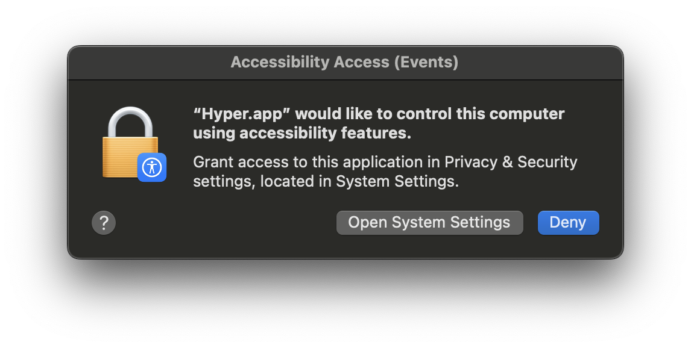
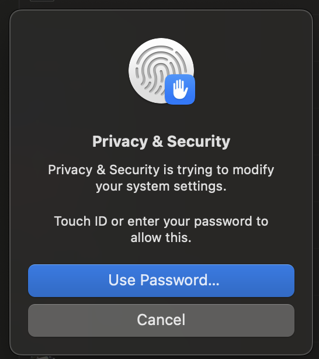

# poetry-typer
Automatic Poetry Typer for MacOS

## Install
```
git clone git@github.com:BDraff/poetry-typer.git
```

### Install Packages
```
python3 -m venv env
source env/bin/activate
pip3 install -r requirements.txt
```

## Usage
```
python3 typer.py <poem-path>
```

#### Example
```
python3 typer.py poems/inventing-dinner.md
```


## Granting permission in system preferences






